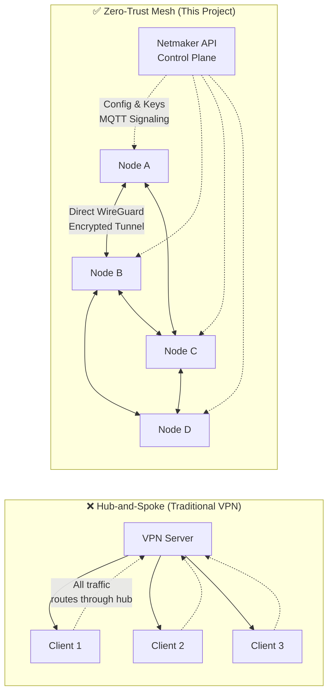
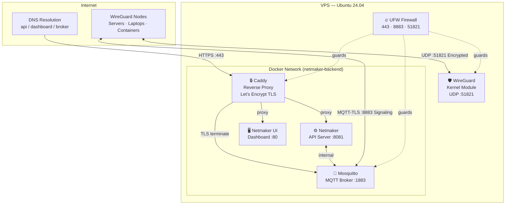

<div align="center">

# 🔐 Zero-Trust Mesh VPN
### WireGuard × Netmaker — Automated Deployment

[](https://terraform.io)
[](https://wireguard.com)
[](https://netmaker.io)
[](https://docker.com)
[](https://caddyserver.com)
[](LICENSE)

*Production-ready, automated Zero-Trust Mesh VPN infrastructure — from DNS to encrypted peer — in under 10 minutes.*

</div>

---

## 📋 Table of Contents
- [Architecture](#-architecture)
- [Why WireGuard?](#-why-wireguard)
- [Prerequisites](#-prerequisites)
- [Quick Start](#-quick-start)
- [Firewall Rules](#-firewall-rules)
- [Project Structure](#-project-structure)
- [Configuration Reference](#-configuration-reference)
- [Upgrading](#-upgrading)
- [Contributing](#-contributing)

---

## 🗺️ Architecture

### Topology Comparison: Hub-and-Spoke vs. Mesh



> **Key Insight:** In a mesh topology, each node communicates directly with every peer using WireGuard — there is no bottleneck at a central server. The Netmaker control plane distributes configuration only; it never carries data traffic.

---

### System Component Diagram



---

## ⚡ Why WireGuard?

WireGuard is a modern, high-performance VPN protocol built directly into the Linux kernel. Here's why it outclasses traditional alternatives:

| Feature | WireGuard | OpenVPN | IPsec |
|---------|-----------|---------|-------|
| **Lines of Code** | ~4,000 | ~70,000 | ~400,000 |
| **Handshake** | 1-RTT (instant) | Multi-step | Complex IKE |
| **Cryptography** | ChaCha20, Poly1305, Curve25519 | Custom negotiation | Suite B |
| **Kernel Integration** | Native (Linux 5.6+) | Userspace tun | Kernel module |
| **Attack Surface** | Minimal | Large | Very large |
| **Throughput** | ~10 Gbps | ~1 Gbps | ~1 Gbps |
| **Battery Impact** | Low (no keepalives) | High | Medium |
| **Configuration** | Simple key pairs | Complex PKI | Very complex |

> WireGuard's cryptographic handshake takes **under 100ms**. The entire protocol fits in a single printable page.

---

## 📦 Prerequisites

| Requirement | Version | Notes |
|-------------|---------|-------|
| Terraform | ≥ 1.7.0 | [Install guide](https://developer.hashicorp.com/terraform/install) |
| DigitalOcean account | — | Or adapt `main.tf` for another cloud provider |
| A domain name | — | With ability to set DNS A records |
| Docker (target server) | ≥ 24.0 | Auto-installed by `setup.sh` |
| Ubuntu (target server) | 22.04 or 24.04 LTS | x86_64 or arm64 |
| SSH key | — | Uploaded to your DigitalOcean account |

---

## 🚀 Quick Start

### Step 1 — Clone & Configure Terraform

```bash
git clone https://github.com/your-username/zero-trust-mesh-vpn.git
cd zero-trust-mesh-vpn

# Create your terraform variables file
cp terraform/terraform.tfvars.example terraform/terraform.tfvars
nano terraform/terraform.tfvars
```

`terraform/terraform.tfvars`:
```hcl
do_token            = "dop_v1_your_digitalocean_api_token"
region              = "nyc3"
droplet_size        = "s-2vcpu-4gb"
ssh_key_fingerprint = "ab:cd:ef:12:34:56:78:90:..."
base_domain         = "vpn.example.com"
environment         = "production"
```

### Step 2 — Provision the VPS

```bash
cd terraform
terraform init
terraform plan -out=tfplan       # Review what will be created
terraform apply tfplan
```

Terraform will output:
```
server_ip        = "143.198.123.45"
dns_instructions = <<-EOT
  Point these DNS A records to 143.198.123.45:
    api.vpn.example.com
    dashboard.vpn.example.com
    broker.vpn.example.com
EOT
```

### Step 3 — Configure DNS

At your domain registrar, create **3 A records** pointing to your server IP:
- `api.vpn.example.com`  → `143.198.123.45`
- `dashboard.vpn.example.com` → `143.198.123.45`
- `broker.vpn.example.com` → `143.198.123.45`

Wait for DNS propagation (usually 1–5 minutes).

### Step 4 — Run the Setup Script

```bash
# SSH into your server
ssh root@143.198.123.45

# Clone this repository on the server
git clone https://github.com/your-username/zero-trust-mesh-vpn.git /opt/mesh-vpn

# Run the automated setup
sudo bash /opt/mesh-vpn/scripts/setup.sh
```

The script will prompt you for:
- **Base Domain** — e.g. `vpn.example.com`
- **Master Key** — auto-generated if you press Enter
- **MQTT Credentials** — auto-generated if you press Enter

### Step 5 — Access the Dashboard

Open `https://dashboard.vpn.example.com` in your browser.

Create your **Admin user** on first login, then:
1. Create a **Network** (e.g., `mesh-net`, CIDR `10.10.0.0/16`)
2. Generate an **Enrollment Key** with your desired expiry
3. On each node you want to join: install `netclient` and enroll:

```bash
curl -sL https://raw.githubusercontent.com/gravitl/netclient/master/scripts/netclient-install.sh | bash
netclient join -t <YOUR_ENROLLMENT_KEY>
```

Your nodes will automatically establish direct WireGuard tunnels! 🎉

---

## 🔥 Firewall Rules

| Port | Protocol | Service | Direction | Reason |
|------|----------|---------|-----------|--------|
| 22 | TCP | SSH | Inbound | Management access |
| 80 | TCP | HTTP | Inbound | ACME Let's Encrypt challenge |
| 443 | TCP | HTTPS | Inbound | Netmaker API + Dashboard |
| 8883 | TCP | MQTT-TLS | Inbound | WireGuard node signaling |
| 51821 | UDP | WireGuard | Inbound | Encrypted mesh tunnels |
| ALL | TCP/UDP | Egress | Outbound | Docker image pulls, DNS, NTP |

> **Zero-Trust Principle:** All traffic not matching the above rules is dropped by default — both at the cloud firewall (Terraform) and host-level UFW.

---

## 📂 Project Structure

```
zero-trust-mesh-vpn/
├── terraform/
│   ├── main.tf          # DigitalOcean droplet + firewall + project
│   ├── variables.tf     # All input variables with validation
│   └── outputs.tf       # Server IP, DNS instructions
├── docker/
│   ├── docker-compose.yml  # Netmaker, UI, Mosquitto, Caddy
│   ├── Caddyfile           # Reverse proxy + auto-TLS
│   ├── mosquitto.conf      # MQTT broker config (overwritten by setup.sh)
│   └── .env.example        # Environment variable template
├── scripts/
│   └── setup.sh         # Full automated deployment script
└── README.md
```

---

## ⚙️ Configuration Reference

| Variable | Description | Default |
|----------|-------------|---------|
| `BASE_DOMAIN` | Root domain for all subdomains | *required* |
| `SERVER_HOST` | Public IP of the VPS | *auto-detected* |
| `MASTER_KEY` | Root API key for Netmaker | *auto-generated* |
| `MQ_USERNAME` | MQTT broker username | `netmaker` |
| `MQ_PASSWORD` | MQTT broker password | *auto-generated* |
| `DISPLAY_KEYS` | Show WireGuard keys in UI | `false` |
| `VERBOSITY` | Log verbosity 0–2 | `1` |

---

## 🔄 Upgrading

```bash
cd /opt/mesh-vpn/docker

# Update image tags in docker-compose.yml, then:
docker compose pull
docker compose up -d --remove-orphans
```

---

## 🤝 Contributing

1. Fork the repository
2. Create a feature branch: `git checkout -b feature/my-improvement`
3. Commit your changes: `git commit -m 'feat: add new feature'`
4. Push to the branch: `git push origin feature/my-improvement`
5. Open a Pull Request

---

## 📄 License

This project is licensed under the **MIT License** — see the [LICENSE](LICENSE) file for details.

---

<div align="center">
Built with ❤️ | Emmanuel Leshan [(https://shanmkuu.vercel.app)]
</div>
